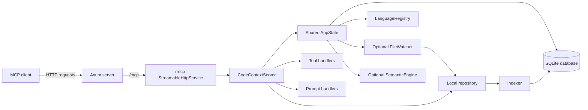

# code-context

> MCP server providing deep codebase context via tree-sitter indexing.

`code-context` sits between MCP clients and a local repository index. Clients call MCP tools over HTTP, and the server answers from persisted repository data instead of reparsing the codebase on every request.



## Features

- Tree-sitter-based indexing for code structure
- SQLite-backed storage with FTS5 full-text search
- Symbol, reference, and import lookup
- File, symbol, and project overview tools
- Built-in MCP prompts for common exploration workflows
- Incremental re-indexing with file watching
- Optional semantic search via the `semantic` feature

## Quick start

```bash
cargo run
```

Install from crates.io:

```bash
cargo install code-context
```

Install a prebuilt binary from GitHub Releases:

```bash
curl --proto '=https' --tlsv1.2 -LsSf \
  https://github.com/dipjyotimetia/code-context/releases/latest/download/code-context-installer.sh | sh
```

By default, the server is available at `http://127.0.0.1:3001/mcp`.

If you're writing a custom MCP client (stateful SSE), the required handshake is:

1. Send `initialize` and read the `Mcp-Session-Id` response header.
2. Send `notifications/initialized` with that `Mcp-Session-Id`.
3. Include `Mcp-Session-Id` on all subsequent requests (`tools/list`, `tools/call`, `prompts/list`, `prompts/get`, etc.).

Index a repository:

```text
index_repository({
  "path": "/absolute/path/to/repository"
})
```

Then use tools such as `get_project_overview`, `search_code`, `search_symbols`, `find_definition`, and `get_symbol_context`, or start with a built-in prompt such as `onboard_repository`.

## Supported languages

`code-context` ships with dedicated tree-sitter queries for Bash, C, C++, C#, Go, HCL, Java, Kotlin, PHP, Python, Ruby, Rust, Scala, Swift, and TypeScript.

The language registry also supports additional formats including JavaScript, TSX, JSON, TOML, YAML, HTML, CSS, and Markdown for indexing and search.

## Build and run

```bash
cargo build
cargo run
```

Enable semantic search:

```bash
cargo run --features semantic
```

Useful Make targets:

- `make build`
- `make run`
- `make check`
- `make test`
- `make help`

## Configuration

| Variable | Default | Purpose |
| --- | --- | --- |
| `HOST` | `127.0.0.1` | Bind address |
| `PORT` | `3001` | Bind port |
| `DATABASE_PATH` | `code_context.db` | SQLite database path |
| `RUST_LOG` | `info` fallback | Tracing filter |
| `MCP_STATEFUL_MODE` | `true` | Use stateful SSE sessions (`initialize` + `Mcp-Session-Id`) |
| `MCP_JSON_RESPONSE` | `false` | When `MCP_STATEFUL_MODE=false`, return JSON instead of SSE |

Example:

```bash
HOST=0.0.0.0 PORT=4000 DATABASE_PATH=.data/code-context.db RUST_LOG=debug cargo run
```

Stateless JSON example:

```bash
MCP_STATEFUL_MODE=false MCP_JSON_RESPONSE=true cargo run
```

## MCP tools

The server exposes tools for:

- repository indexing and watching
- full-text and symbol search
- definition and reference lookup
- import, call-graph, and dependency views
- file, symbol, and project context

It also exposes guided MCP prompts for common workflows such as onboarding a repository, exploring a codebase question, tracing dependencies, and reviewing change impact.

## Development

```bash
make check
make test
make run
```

## Release process

Releases are automated in two stages:

- `release-plz` runs on `main`, opens or updates a release PR, and publishes the crate plus GitHub Release when that PR is merged.
- `cargo-dist` runs in the same release workflow after a crate release is created and attaches packaged binaries, checksums, and install scripts for supported platforms.

Required repository setup:

- Configure crates.io trusted publishing for this repository so the `Release Plz` workflow can publish without a long-lived registry token.
- In repository Actions settings, allow GitHub Actions to create and approve pull requests so `release-plz` can maintain the release PR.

## Documentation

- [Architecture](./docs/architecture.md)
- [Design decisions](./docs/design-decisions.md)
- [Why Rust?](./docs/design-decisions.md#decision-1-implement-the-server-in-rust)
- [Code of Conduct](./CODE_OF_CONDUCT.md)
- [Security Policy](./SECURITY.md)
- [License](./LICENSE)
