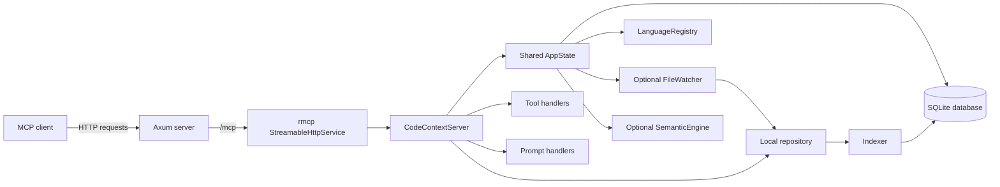
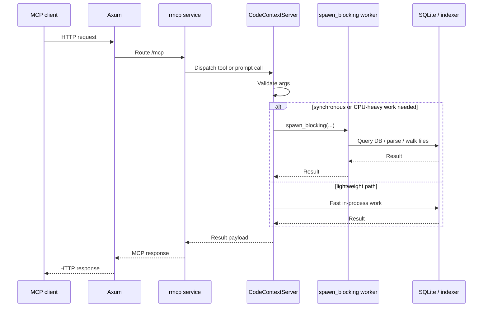
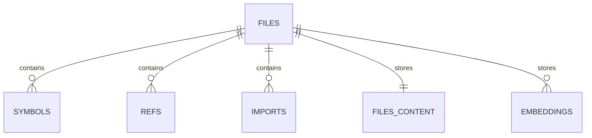

# Architecture

This document gives maintainers a quick mental model of how `code-context` is put together at runtime.

It focuses on the current implementation:

- Rust MCP server built with **Axum** and **rmcp**
- streamable HTTP transport mounted at **`/mcp`**
- repository indexing powered by **tree-sitter**
- persistent storage in **SQLite** with **FTS5**
- incremental updates via **notify-debouncer-full**
- optional semantic search behind the **`semantic`** Cargo feature

## System context

`code-context` sits between MCP clients and a local repository index. Clients call MCP tools over HTTP, and the server answers from persisted repository data instead of reparsing the codebase on every request.



## Runtime components

### Process entry point

[`src/main.rs`](../src/main.rs) is responsible for:

1. initializing tracing
2. reading `HOST`, `PORT`, and `DATABASE_PATH`
3. opening SQLite and initializing schema
4. building the language registry
5. optionally initializing the semantic engine when the `semantic` feature is enabled
6. creating the rmcp streamable HTTP service
7. mounting it under `/mcp` in an Axum router
8. serving until shutdown

Default configuration:

| Setting | Default |
| --- | --- |
| `HOST` | `127.0.0.1` |
| `PORT` | `3001` |
| `DATABASE_PATH` | `code_context.db` |

### Shared application state

[`src/state.rs`](../src/state.rs) defines `AppState`, which is cloned into MCP handlers:

| Field | Purpose |
| --- | --- |
| `db: Arc<Database>` | Shared database access |
| `registry: Arc<LanguageRegistry>` | Language detection, parsers, and queries |
| `watcher: Arc<tokio::sync::Mutex<Option<FileWatcher>>>` | Active watcher, if any |
| `semantic: Arc<Option<SemanticEngine>>` | Optional semantic engine when compiled with `semantic` |

This keeps long-lived resources in one place and makes handler construction cheap.

### Server and tool surface

[`src/server.rs`](../src/server.rs) defines `CodeContextServer` and registers both MCP tools and MCP prompts.

The tool set is grouped by concern:

- indexing and watch control
- text and symbol search
- definition and reference navigation
- graph-style views
- file, symbol, and project context

The prompt set provides guided workflows such as:

- onboarding a repository
- exploring a codebase question
- understanding a symbol
- tracing file dependencies
- reviewing change impact

Handlers mostly validate arguments, clone shared state, and offload synchronous work to blocking threads when needed.

### Database layer

[`src/db/mod.rs`](../src/db/mod.rs) uses an r2d2 pool of `rusqlite::Connection` objects.

That means:

- reads and writes are persisted in one local SQLite database
- read-heavy workloads can run concurrently across pooled connections
- call sites use `with_conn` or `with_tx` to keep transaction handling consistent

Schema creation lives in [`src/db/schema.rs`](../src/db/schema.rs), and query logic lives in [`src/db/queries.rs`](../src/db/queries.rs).

### Indexer

[`src/indexer`](../src/indexer/) is responsible for turning repository files into structured records:

- `walker.rs` finds candidate files
- `languages.rs` maps extensions to languages and loads queries/parsers
- `parser.rs` extracts definitions, references, and imports
- `graph.rs` computes scope paths from AST ancestry
- `mod.rs` coordinates full-repository and single-file indexing

### Watcher

[`src/watcher/mod.rs`](../src/watcher/mod.rs) owns recursive file watching and incremental reindexing.

It uses `notify-debouncer-full` with an 800 ms debounce window and feeds debounced paths into a Tokio task.

## Request flow

For a typical MCP request, the path through the system looks like this:



### Why `spawn_blocking` shows up often

Several important code paths are synchronous:

- `rusqlite` database access
- repository walking
- file reads
- tree-sitter parsing and extraction

Tool handlers use `tokio::task::spawn_blocking` so the async runtime is not stalled by synchronous I/O or CPU-heavy parsing work.

## Indexing pipeline

Repository indexing is implemented primarily in [`src/indexer/mod.rs`](../src/indexer/mod.rs).

### 1. Discover candidate files

[`walker.rs`](../src/indexer/walker.rs) uses `ignore::WalkBuilder` and:

- respects `.gitignore`, global ignore, and git exclude rules
- does not follow symlinks
- caps traversal depth at 50
- skips files larger than 1 MB
- skips likely binary files by checking for NUL bytes in the first 8 KB
- keeps only files whose extension maps to a registered language

The resulting file list is sorted before indexing begins.

### 2. Process files in batches

`index_repository` processes files in batches of 100. Each batch runs inside `Database::with_tx`.

This gives a practical middle ground:

- fewer commits than per-file writes
- partial progress if a later batch fails

### 3. Index each file

For each file, the indexer:

1. makes the path repository-relative
2. detects the language
3. reads the file as UTF-8 text
4. computes a SHA-256 content hash
5. skips unchanged files when the stored hash matches
6. removes stale rows for changed files
7. upserts the `files` row
8. stores raw content in `files_content`
9. parses the file with tree-sitter
10. extracts definitions, references, and imports
11. computes `scope_path` values from AST ancestry
12. inserts symbols, refs, and imports
13. updates the FTS row in `code_fts`

The indexer reports:

- indexed files
- skipped files
- symbols found
- references found
- errors

### Parsing strategy

Extraction in [`parser.rs`](../src/indexer/parser.rs) is layered:

1. try a language-specific tree-sitter query from the registry
2. if no query exists, fall back to generic AST-based extraction for common constructs

The query-backed path is more precise. The fallback keeps unsupported or lightly-supported languages useful for basic indexing.

### Scope-path enrichment

After parsing, [`graph.rs`](../src/indexer/graph.rs) walks ancestor nodes to compute a dotted scope path such as:

```text
MyType.my_method
```

This metadata improves symbol-oriented responses without changing the underlying source.

## Storage model

Schema initialization lives in [`src/db/schema.rs`](../src/db/schema.rs).

### Connection pragmas

The server enables:

- `PRAGMA journal_mode = WAL`
- `PRAGMA foreign_keys = ON`
- `PRAGMA busy_timeout = 5000`

### Core tables

| Table | Purpose |
| --- | --- |
| `schema_version` | Tracks schema version metadata |
| `files` | One row per indexed file |
| `symbols` | Definitions extracted from files |
| `refs` | Symbol references extracted from files |
| `imports` | File-level import relationships |
| `files_content` | Stored raw content for context and regex search |
| `embeddings` | Semantic chunks and vectors |
| `code_fts` | FTS5 full-text search index |

### Data relationships



Most child tables point back to `files(id)` with `ON DELETE CASCADE`, so deleting a file row clears dependent index data automatically.

### Search-oriented storage

- `code_fts` stores symbol names and content for full-text search
- `files_content` supports context retrieval and regex search over stored source
- `embeddings` exists in the schema even when the `semantic` feature is not enabled

## Watcher lifecycle

The watcher is implemented in [`src/watcher/mod.rs`](../src/watcher/mod.rs).

### What it does

- watches the repository recursively
- debounces events for 800 ms
- ignores `Access` events to avoid reindexing on reads
- sends debounced file paths into a Tokio task
- reindexes supported-language files
- removes deleted files from SQLite

### Active watcher model

`watch_repository` stores the watcher in `AppState.watcher`, which means the server keeps at most one active watcher at a time.

Current behavior:

- starting a watcher replaces the previous one
- `stop_watching` cancels and drops the current watcher
- dropping the watcher also cancels its task

### Incremental reindex path

When a debounced change arrives:

1. if the path no longer exists, remove it from the index
2. if the language is unsupported, ignore it
3. otherwise call `index_single_file`

`index_single_file` still performs hash-based change detection, so a watcher event does not guarantee a write.

## Semantic search boundary

Semantic search is compiled only when the `semantic` feature is enabled:

```bash
cargo run --features semantic
```

When enabled:

- `src/semantic` is compiled
- startup attempts to initialize `SemanticEngine`
- `AppState` may carry the engine
- the `semantic_search` tool can query stored embeddings

Important current boundary: the schema and engine support embeddings, but embedding generation is not part of the normal repository indexing path today. The semantic search path is present; embedding population is a separate integration step.

## Extension points

### Add or improve language support

Primary files:

- [`src/indexer/languages.rs`](../src/indexer/languages.rs)
- [`languages/`](../languages/)
- [`src/indexer/parser.rs`](../src/indexer/parser.rs)

Typical work:

1. add the tree-sitter grammar dependency
2. register the language and extensions
3. add or refine a query file for higher-fidelity extraction
4. use the generic fallback only where queries are unavailable or insufficient

### Add a new MCP tool

Primary files:

- [`src/tools/`](../src/tools/)
- [`src/server.rs`](../src/server.rs)

Typical work:

1. define argument types with `serde` and `schemars`
2. implement the handler
3. register it on `CodeContextServer`
4. use `spawn_blocking` for synchronous database or indexing work

### Extend stored data

Primary files:

- [`src/db/schema.rs`](../src/db/schema.rs)
- [`src/db/queries.rs`](../src/db/queries.rs)

Update schema and query code together so persisted structure and runtime access stay aligned.

### Change indexing behavior

Primary files:

- [`src/indexer/mod.rs`](../src/indexer/mod.rs)
- [`src/indexer/walker.rs`](../src/indexer/walker.rs)
- [`src/indexer/parser.rs`](../src/indexer/parser.rs)
- [`src/watcher/mod.rs`](../src/watcher/mod.rs)

These modules define the main ingestion path, so changes here affect both full indexing and watcher-driven updates.
