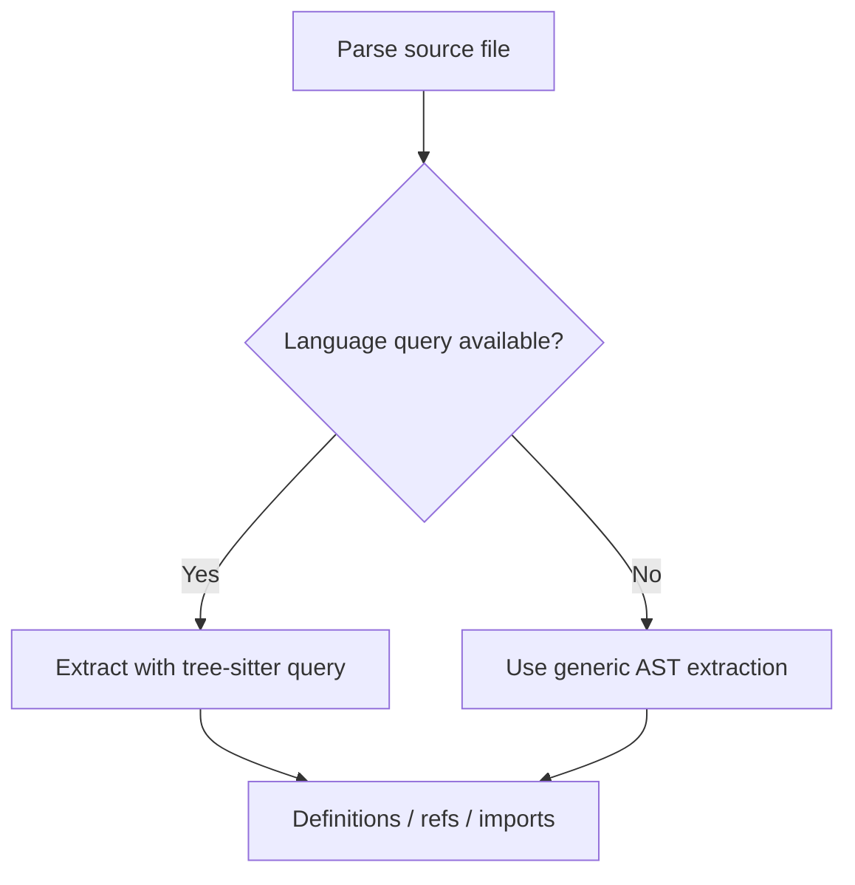

# Design decisions

This document explains the main implementation choices in `code-context`.

It is not a roadmap. It records the decisions visible in the current codebase, why they make sense here, what they cost, and what signals would justify revisiting them.

## At a glance

| Area | Current choice |
| --- | --- |
| Implementation language | Rust |
| MCP transport | Streamable HTTP via `rmcp`, mounted at `/mcp` |
| Parsing | tree-sitter parsers with language-specific queries where available |
| Persistence | SQLite with FTS5 |
| DB access model | One `rusqlite::Connection` guarded by a `Mutex` |
| Async boundary | `spawn_blocking` around synchronous DB and parsing work |
| MCP interaction model | Low-level tools plus higher-level guided prompts |
| Watching | One active recursive watcher with 800 ms debounce |
| Semantic search | Feature-gated behind Cargo feature `semantic` |
| Extraction strategy | Query-backed extraction first, generic fallback second |

## Decision 1: implement the server in Rust

**Decision**  
Implement `code-context` in Rust rather than Python, TypeScript, or another higher-level runtime language.

**Rationale**

- The core workload is a good fit for Rust: tree-sitter parsing, repository walking, SQLite access, hashing, and structured indexing are performance-sensitive and run frequently.
- Rust makes it straightforward to ship a single native binary with predictable runtime behavior and no separate interpreter or Node/Python environment requirement.
- The codebase mixes async request handling with synchronous parsing and database work; Rust gives tight control over those boundaries.
- Strong static typing helps when evolving a tool-heavy server surface with many structured request and response types.
- The project already depends on several native libraries and systems-level crates, so Rust keeps the implementation language aligned with that ecosystem.

**Why not Python or TypeScript?**

- **Python** would likely be faster to prototype, but this project spends a lot of time in parsing, indexing, file-system work, and local database access, where a compiled systems language is a better long-term fit.
- **TypeScript** would be attractive for teams already building MCP tooling in the JavaScript ecosystem, but the runtime model, dependency footprint, and native-library integration are less compelling for this server's current shape.
- Both Python and TypeScript would reduce the barrier for some contributors, but the current implementation optimizes more for runtime efficiency, deployment simplicity, and correctness under load than for fastest initial iteration.

**Tradeoffs**

- Rust has a steeper learning curve than Python or TypeScript.
- Contributor velocity can be slower for teams that are more comfortable in dynamic languages.
- Compile times and ownership-driven refactors add development friction compared with scripting-oriented stacks.

**When to revisit**

- If the project shifts toward rapid scripting, plugin authoring, or application-level orchestration rather than indexer/runtime performance.
- If contributor accessibility becomes a larger priority than single-binary deployment and systems-level control.
- If most future value moves into MCP workflow composition rather than the indexing engine itself.

## Decision 2: use streamable HTTP MCP transport

**Decision**  
Expose the MCP server over rmcp's streamable HTTP transport and mount it at `/mcp` behind Axum.

**Rationale**

- It fits naturally with an Axum-based server process.
- It keeps transport concerns separate from tool logic.
- The current server configuration is simple and explicit in `src/main.rs`.
- HTTP makes local deployment and client integration straightforward.

**Tradeoffs**

- HTTP transport adds server setup and routing concerns that a stdio-only tool would not need.
- Session and transport behavior are partly shaped by the rmcp transport implementation.
- Debugging transport-level behavior can be less direct than debugging a single-process CLI-style interface.

**When to revisit**

- If the project needs a different deployment model, such as stdio-first embedding.
- If transport configuration becomes a source of complexity for supported clients.
- If future MCP client expectations make another transport more practical.

## Decision 3: use tree-sitter for parsing and structure extraction

**Decision**  
Use tree-sitter grammars to parse source files and extract definitions, references, imports, doc comments, and scope information.

**Rationale**

- tree-sitter supports a broad set of languages in one architecture.
- Parsed syntax trees are more reliable than regex-only extraction.
- The project can combine compiled grammars with language-specific query files.
- The same parsing foundation supports both indexing and richer navigation features.

**Tradeoffs**

- Each additional language increases grammar and query maintenance.
- Extraction quality depends on the language query coverage.
- Parsing is CPU work and remains synchronous in this codebase, so it must be handled carefully in async handlers.

**When to revisit**

- If language support grows beyond what compiled-in grammars are easy to maintain.
- If the project needs language-server-grade semantic understanding rather than syntax-oriented extraction.
- If a subset of languages would benefit from a deeper, language-specific parser pipeline.

## Decision 4: use SQLite with FTS5 as the local index store

**Decision**  
Persist repository data in SQLite and use FTS5 for full-text search.

**Rationale**

- SQLite keeps setup simple for local-first indexing.
- A single database file works well for open-source usage and testing.
- FTS5 provides built-in text search without adding another service.
- The schema can store structured metadata and search-oriented content together.

**Tradeoffs**

- SQLite is a local embedded database, not a distributed search service.
- Some query patterns are constrained by what is efficient in one file-backed database.
- Full-text search and structured graph-style queries must share the same storage engine and tuning envelope.

**When to revisit**

- If the project needs multi-process write throughput beyond the current model.
- If repositories or query volume outgrow a single local database comfortably.
- If search requirements exceed what FTS5 can provide with acceptable complexity.

## Decision 5: use a small SQLite connection pool

**Decision**  
Use an r2d2 pool of `rusqlite::Connection` objects instead of a single guarded connection.

**Rationale**

- SQLite in WAL mode supports multiple concurrent readers.
- A small pool lets read-heavy tools (search, navigation, context) run in parallel.
- It keeps the API surface simple (`with_conn`, `with_tx`) while avoiding a single mutex bottleneck.
- It still fits the local-first deployment model.

**Tradeoffs**

- More connections increase SQLite resource usage and open file handles.
- Write operations still serialize at the database level, so parallelism is limited under heavy write load.
- Pool configuration becomes another tuning knob (max size, idle connections, timeouts).

**When to revisit**

- If connection churn or file-handle limits become an issue.
- If write-heavy workloads dominate and pooling no longer helps.
- If the storage layer moves toward a different database or async-native access.

## Decision 6: use `spawn_blocking` around synchronous work

**Decision**  
Offload synchronous database calls, file walking, and parsing work from async handlers using `tokio::task::spawn_blocking`.

**Rationale**

- `rusqlite` is synchronous.
- tree-sitter parsing and repository walking are CPU-heavy or blocking operations.
- Keeping these operations off the core async executor reduces the chance of stalling unrelated requests.

**Tradeoffs**

- Blocking work still consumes resources; it is only isolated, not eliminated.
- Errors and cancellation now cross an async-to-blocking boundary.
- Overuse can make control flow harder to read than fully synchronous code.

**When to revisit**

- If the project adopts async-native storage or different parsing boundaries.
- If blocking task volume becomes a measurable operational issue.
- If some handlers can be simplified by moving more work out of the request path entirely.

## Decision 7: expose both tools and guided prompts

**Decision**  
Expose low-level MCP tools for direct querying and add guided MCP prompts for common multi-step workflows.

**Rationale**

- Tools keep the server composable and scriptable.
- Prompts capture recommended usage patterns for common tasks such as onboarding and codebase exploration.
- This gives clients a higher-level entry point without removing precise control.
- The two layers complement each other: prompts orchestrate, tools execute.

**Tradeoffs**

- The surface area becomes larger to document and maintain.
- Prompt guidance can drift if tool behavior evolves and prompts are not updated.
- Some clients may ignore prompt support entirely, so prompts should not become the only usable path.

**When to revisit**

- If prompt maintenance becomes noisy compared with the value it provides.
- If the project needs a stricter separation between machine-oriented APIs and guided workflows.
- If MCP client support for prompts is inconsistent enough that the extra surface is not worth it.

## Decision 8: allow only one active watcher

**Decision**  
Store a single `Option<FileWatcher>` in shared state and replace the existing watcher when `watch_repository` is called again.

**Rationale**

- The behavior is easy to explain to MCP clients.
- Shared mutable state stays small and explicit.
- It avoids complexity around multiple overlapping watchers and repository roots.
- The current tool surface is repository-at-a-time in practice.

**Tradeoffs**

- The server cannot watch multiple repositories at once.
- Starting a new watcher implicitly stops the old one.
- Multi-repository workflows need separate server processes or manual watcher switching.

**When to revisit**

- If multi-repository watching becomes a common use case.
- If tools begin to manage multiple indexed roots in one process.
- If watcher lifecycle management needs stronger isolation per repository.

## Decision 9: make semantic search feature-gated

**Decision**  
Compile semantic search only when the Cargo feature `semantic` is enabled.

**Rationale**

- It keeps the default build smaller and simpler.
- Embedding models add extra initialization cost and dependency weight.
- Not every deployment needs semantic search.
- The project can ship a stable baseline without requiring embedding support.

**Tradeoffs**

- Feature-dependent behavior makes documentation and testing slightly more complex.
- Users can enable semantic search at build time but still have no embeddings populated to query.
- Some code paths exist only in feature-enabled builds.

**When to revisit**

- If semantic search becomes core rather than optional.
- If the operational cost of the semantic path becomes negligible.
- If embedding population is integrated into the default indexing flow and expected by most users.

## Decision 10: prefer query-backed extraction, with a generic fallback

**Decision**  
Try language-specific tree-sitter queries first. If a language has no query, fall back to generic AST-based extraction.

**Rationale**

- Query-backed extraction gives better fidelity for well-supported languages.
- A fallback keeps the indexer useful across a broader set of formats.
- This avoids an all-or-nothing support model.

**Tradeoffs**

- Behavior is not perfectly uniform across all languages.
- Fallback extraction is intentionally less precise than query-backed extraction.
- Maintaining both paths adds code and testing surface.

**When to revisit**

- If a language becomes important enough to justify dedicated query coverage.
- If the fallback path causes too many false positives or misses for a target language.
- If extraction logic is refactored into a more explicit per-language capability model.

## Decision 11: keep watcher-driven updates incremental

**Decision**  
On file change, reindex only the changed supported-language file or remove it if it was deleted.

**Rationale**

- It keeps watch mode responsive.
- It avoids full repository reindexing for common edit loops.
- The same single-file indexing path reuses the hash check and database logic.

**Tradeoffs**

- File-local reindexing assumes enough information can be refreshed from one file at a time.
- Burst changes still depend on debounce quality and serialized database access.
- Some cross-file relationships are only as current as the last affected file updates.

**When to revisit**

- If watch mode needs stronger consistency guarantees across large refactors.
- If incremental updates become slower than expected on real repositories.
- If dependency modeling requires broader invalidation than per-file reindexing.

## Decision 12: store raw file content alongside structured metadata

**Decision**  
Persist file content in `files_content` in addition to storing structured records such as symbols, refs, and imports.

**Rationale**

- Context-oriented tools need source snippets without rereading the repository every time.
- Regex search can run over indexed content.
- Full-text indexing and structured metadata can stay aligned with the same persisted snapshot.

**Tradeoffs**

- The database grows with repository content size.
- Stored content can become stale if the repository changes without reindexing.
- Some operations duplicate information already present on disk.

**When to revisit**

- If database size becomes a practical issue for target repositories.
- If a different caching strategy would serve context retrieval better.
- If the project separates text search storage from structured metadata storage.
